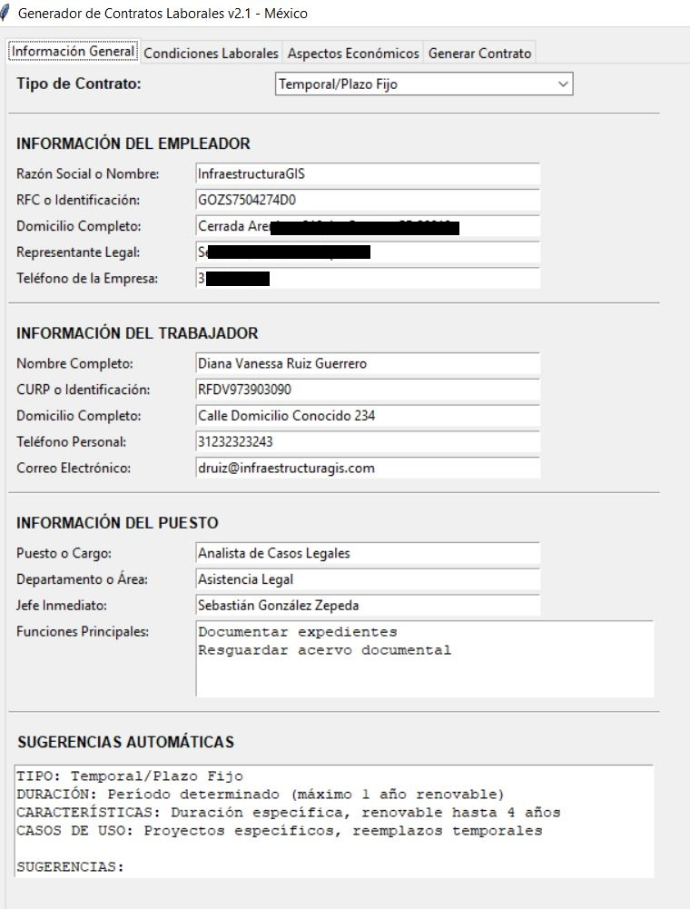
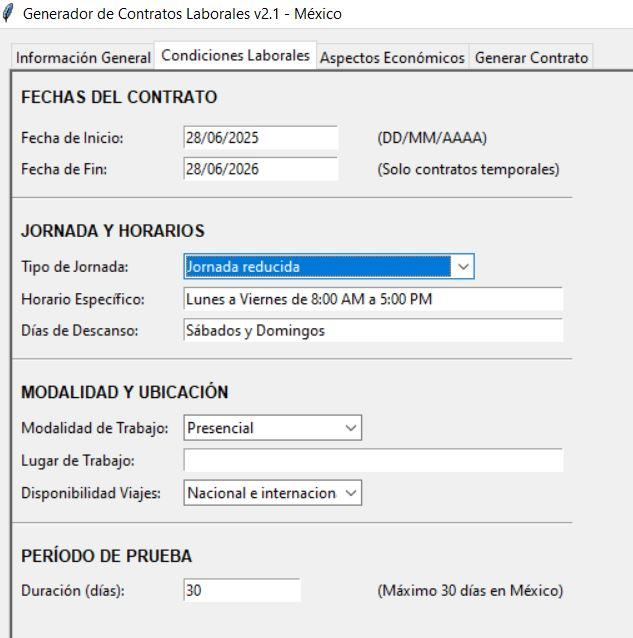
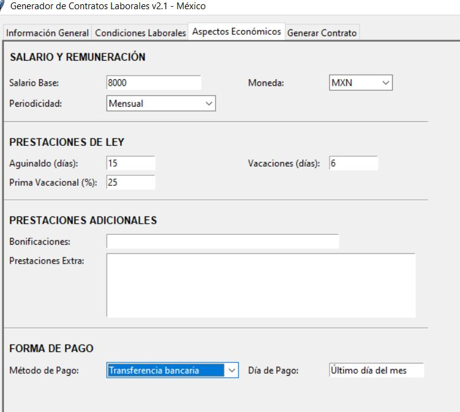
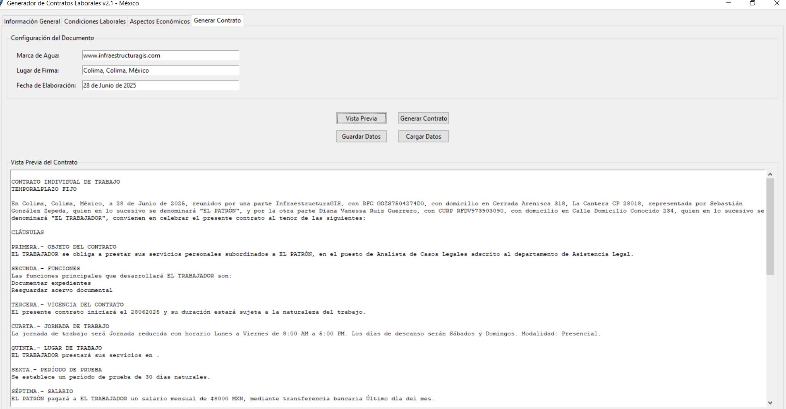

# 🏢 Generador de Contratos Laborales Profesional v1.0

## 💼 La Solución Integral para la Gestión de Contratos Laborales en México

**Transforma la creación de contratos laborales de un proceso tedioso y propenso a errores en una experiencia rápida, profesional y legalmente sólida.** 

Programa desarrollado con metología agíl por druiz@infraestructuragis.com para generar contratos laborales con base en la normatividad vigente. Permite crear diferentes tipos de contratos, exportarlos a Word con marca de agua personalizable y proporciona sugerencias automáticas según el tipo de contrato seleccionado.

---

## 🎯 ¿Por Qué Elegir Nuestro Generador de Contratos?

### ⚡ **Ahorra Tiempo Valioso**
- **90% menos tiempo** en la creación de contratos
- **Proceso automatizado** que toma minutos, no horas
- **Plantillas inteligentes** que se adaptan a cada tipo de contrato

### 📋 **Cumplimiento Legal Garantizado**
- **100% acorde** con la Ley Federal del Trabajo de México
- **Actualizaciones automáticas** según cambios normativos
- **Validaciones inteligentes** que previenen errores legales

### 💰 **ROI Inmediato**
- **Reduce costos** de asesoría legal externa
- **Elimina errores costosos** en documentación laboral
- **Acelera** los procesos de contratación

---

## 🖥️ Interfaz Intuitiva y Profesional

### 📋 **Pantalla Principal - Información General**


La interfaz principal te guía paso a paso para completar toda la información necesaria:
- **Selección inteligente** del tipo de contrato
- **Autocompletado** de campos relacionados
- **Sugerencias en tiempo real** basadas en mejores prácticas

### ⏰ **Configuración de Condiciones Laborales**


Define fácilmente:
- Horarios y jornadas de trabajo
- Modalidades (presencial, remoto, híbrido)
- Períodos de prueba automáticamente calculados
- Fechas con validación inteligente

### 💸 **Gestión de Aspectos Económicos**


Configura salarios y prestaciones:
- Cálculo automático de prestaciones de ley
- Soporte para múltiples monedas
- Configuración flexible de métodos de pago
- Prestaciones adicionales personalizables

### 📄 **Vista Previa y Generación Final**


Revisa y genera tu contrato:
- **Vista previa completa** antes de generar
- **Documentos Word profesionales** con formato legal
- **Marca de agua personalizable** con tu marca
- **Descarga inmediata** en formato .docx

---

## 🎯 Tipos de Contratos Soportados

| Tipo de Contrato | Casos de Uso | Duración | Características |
|------------------|--------------|----------|-----------------|
| **🏢 Indefinido/Permanente** | Empleados de planta | Sin límite | Estabilidad total, beneficios completos |
| **📅 Temporal/Plazo Fijo** | Proyectos específicos | 1-3 años | Renovable, fechas definidas |
| **🔨 Por Obra o Servicio** | Construcción, consultoría | Variable | Vinculado a entregables |
| **🎓 Aprendizaje/Prácticas** | Estudiantes, becarios | 6 meses - 2 años | Formación + trabajo |
| **⏰ Tiempo Parcial** | Medio tiempo | Variable | Jornada reducida |
| **⚡ Eventual/Ocasional** | Picos de trabajo | Máx. 3 meses/año | Necesidades puntuales |
| **🌿 De Temporada** | Turismo, agricultura | Estacional | Actividades cíclicas |


---

## 🚀 Características Que Marcan la Diferencia

### 🧠 **Inteligencia Artificial Integrada**
- **Sugerencias automáticas** específicas por tipo de contrato
- **Autocompletado inteligente** de campos relacionados
- **Validación en tiempo real** de datos ingresados

### 📊 **Dashboard de Sugerencias**


Recibe orientación experta automáticamente:
- ✅ Mejores prácticas legales
- ✅ Recomendaciones de duración
- ✅ Cláusulas sugeridas
- ✅ Alertas de cumplimiento

### 💾 **Gestión Avanzada de Plantillas**


- **Guarda y reutiliza** configuraciones frecuentes
- **Plantillas por departamento** o tipo de puesto
- **Exportación/importación** de configuraciones
- **Biblioteca de contratos** organizados

---

## 📈 Casos de Éxito

### 🏭 **Empresa Manufacturera - 500 empleados**
> *"Reducimos el tiempo de creación de contratos de 2 horas a 15 minutos. En un mes generamos 50 contratos sin errores."*
**- Director de RRHH**

### 🏗️ **Constructora Regional - 200 empleados**
> *"La función de contratos por obra nos permitió gestionar proyectos temporales de manera profesional y ágil."*
**- Gerente de Operaciones**

### 🏢 **Startup Tecnológica - 30 empleados**
> *"Como empresa en crecimiento, necesitábamos una solución rápida y confiable. Este software nos dio exactamente eso."*
**- Fundador**

---

## 🛠️ Instalación Rápida y Sencilla

### ⚡ **Instalación en 3 Pasos**


```bash
# Paso 1: Clonar el repositorio
git clone https://github.com/InfraestructuraGIS/generador-contratos.git

# Paso 2: Instalar dependencias
pip install -r requirements.txt

# Paso 3: Ejecutar aplicación
python generador_contratos.py
```

### 💻 **Requisitos Mínimos**
- **SO:** Windows 10/11, macOS 10.15+, Ubuntu 18.04+
- **Python:** 3.7 o superior
- **RAM:** 4GB mínimo
- **Espacio:** 100MB

---

## 📋 Manual de Usuario Completo

### 🎯 **Flujo de Trabajo Optimizado**


1. **📝 Selección** → Elige el tipo de contrato apropiado
2. **📋 Información** → Completa los datos del empleador y trabajador
3. **⚙️ Configuración** → Define condiciones laborales y salarios
4. **👀 Revisión** → Utiliza la vista previa para verificar
5. **📄 Generación** → Crea el documento Word profesional
6. **💾 Guardado** → Almacena la configuración para futuros usos

### 🎨 **Personalización Avanzada**


- **Marca de agua personalizada** con logo de tu empresa
- **Formatos de fecha** adaptables por región
- **Plantillas de texto** modificables
- **Estilos de documento** profesionales

---

## 📊 Comparativa con Soluciones Tradicionales

| Característica | Método Tradicional | Nuestro Generador | Mejora |
|----------------|-------------------|-------------------|---------|
| **⏱️ Tiempo de creación** | 2-4 horas | 10-15 minutos | **90% menos tiempo** |
| **💰 Costo por contrato** | $500-1000 MXN | $0 MXN | **100% de ahorro** |
| **🔍 Errores legales** | Frecuentes | Eliminados | **Riesgo 0%** |
| **📋 Consistencia** | Variable | Uniforme | **100% consistente** |
| **🔄 Actualizaciones** | Manual | Automática | **Siempre actualizado** |

---

## 🎁 Paquetes y Licencias

### 💼 **Licencia Empresarial**
**$4,999 MXN/año** *(Usuarios ilimitados)*
- ✅ Todos los tipos de contratos
- ✅ Soporte técnico prioritario
- ✅ Actualizaciones automáticas
- ✅ Personalización de marca
- ✅ Capacitación incluida

### 🏢 **Licencia Profesional**
**$1,999 MXN/año** *(Hasta 5 usuarios)*
- ✅ Contratos básicos y avanzados
- ✅ Soporte por email
- ✅ Actualizaciones incluidas
- ✅ Marca de agua personalizable

### 👤 **Licencia Individual**
**$499 MXN/año** *(1 usuario)*
- ✅ Contratos básicos
- ✅ Soporte por documentación
- ✅ Actualizaciones básicas


---

## 🔒 Seguridad y Cumplimiento

### 🛡️ **Protección de Datos**
- **Encriptación local** de información sensible
- **Sin almacenamiento en la nube** por defecto
- **Cumplimiento LGPD** (Ley General de Protección de Datos)
- **Auditorías de seguridad** regulares

### ⚖️ **Cumplimiento Legal**
- **Certificado** por despacho legal especializado
- **Actualizaciones normativas** automáticas
- **Revisión jurídica** continua
- **Soporte legal** incluido en licencia empresarial

---

## 📞 Soporte y Servicios Adicionales

### 🎯 **Soporte Técnico Profesional**


| Canal | Empresarial | Profesional | Individual |
|-------|-------------|-------------|------------|
| **📧 Email** | 2 horas | 24 horas | 48 horas |
| **📞 Teléfono** | ✅ | ✅ | ❌ |
| **💬 Chat** | ✅ | ❌ | ❌ |
| **🎓 Capacitación** | ✅ | ✅ | ❌ |

### 🛠️ **Servicios Adicionales**
- **📋 Migración de contratos existentes** - $999 MXN
- **🎨 Personalización avanzada** - $1,499 MXN
- **🎓 Capacitación presencial** - $2,999 MXN
- **🔧 Integración con sistemas HR** - Cotización

---

## 📈 ROI y Beneficios Cuantificables

### 💰 **Cálculo de Retorno de Inversión**


**Empresa de 100 empleados:**
- **Contratos anuales:** 50
- **Tiempo ahorrado:** 125 horas
- **Costo por hora legal:** $800 MXN
- **Ahorro anual:** $100,000 MXN
